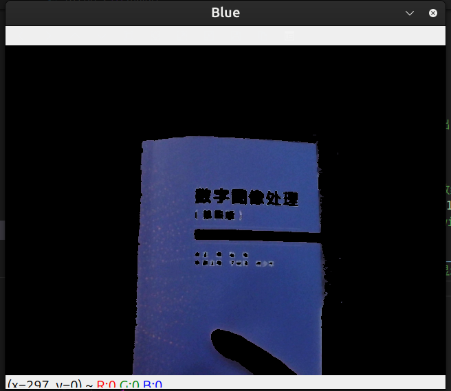

# 预备队视觉组学习笔记

## opencv基础学习

### 一、Mat

#### 1.基础mat类型

| 枚举常量   | 数值 | 含义                                |
| ---------- | ---- | ----------------------------------- |
| `CV_8UC1`  | 0    | 8 位无符号单通道（灰度）            |
| `CV_8UC3`  | 16   | 8 位无符号 3 通道（BGR 彩图）       |
| `CV_8UC4`  | 24   | 8 位无符号 4 通道（BGRA 带透明）    |
| `CV_32FC1` | 5    | 32 位浮点单通道（深度图、卷积特征） |
| `CV_32FC3` | 21   | 32 位浮点 3 通道（彩色图像处理）    |
| `CV_64FC1` | 6    | 64 位浮点单通道（矩阵运算、雅可比） |

#### 2.使用imread读取该图片，并使用imshow可视化该图片

```c++
int main() {
    // 读取图片
    cv::Mat image = cv::imread("example.jpg");

    // 检查图片是否成功加载
    if (image.empty()) {
        std::cout << "无法加载图片！" << std::endl;
        return -1;
    }

    // 显示图片
    cv::imshow("Display Image", image);

    // 等待按键（参数为0时，无限等待，直到用户按下任意键，返回该键的ASCII码）
    cv::waitKey(0);

}
```

### 二、摄像头和颜色

#### 1.VideoCapture类

```c++
int main() {
    // 创建 VideoCapture 对象并打开视频文件/默认摄像头
    VideoCapture cap("example.mp4/0");

    if (!cap.isOpened()) {
        std::cerr << "Error: Could not open " << std::endl;
        return -1;
    }

        Mat frame;
        while (true) {
        cap >> frame;
        if (frame.empty()) {
            break;
        }

		//对Frame进行处理
		pass
		
        imshow("Frame", frame);

        if (waitKey(30) == 27) {
            break;
        }
}

    cap.release();
    destroyAllWindows();
}
```

#### 2.HSV色彩空间

HSV中,H为色调，S为饱和度，V为明度

其中，常见色彩的范围为

| 颜色 | Hmin‐Hmax       | Smin‐Smax | Vmin‐Vmax | 备注                      |
| ---- | --------------- | --------- | --------- | ------------------------- |
| 红   | 0‐10 ＋ 170‐180 | 70‐255    | 50‐255    | 跨 0°，要两次 mask        |
| 橙   | 11‐25           | 70‐255    | 50‐255    | 易与红/黄混，可缩到 15‐20 |
| 黄   | 26‐34           | 70‐255    | 50‐255    | 室外阳光最强              |
| 绿   | 35‐85           | 70‐255    | 50‐255    | 植物、交通灯              |
| 青   | 86‐100          | 70‐255    | 50‐255    | Tiffany 蓝、泳池水        |
| 蓝   | 101‐130         | 70‐255    | 50‐255    | 天空、LOGO                |
| 紫   | 131‐170         | 70‐255    | 50‐255    | 舞台灯、葡萄              |
| 粉   | 160‐175         | 50‐200    | 180‐255   | 降 S 显“淡”               |
| 白   | 0‐180（任意）   | 0‐30      | 180‐255   | 高 V 低 S                 |
| 黑   | 0‐180（任意）   | 0‐255     | 0‐50      | 低 V                      |
| 灰   | 0‐180（任意）   | 0‐30      | 50‐180    | 介于黑/白之间             |

其中，红色跨越了180度分界，所以要做两次掩码

提取蓝色的核心处理代码为：

```c++
//hsv用来生成掩膜mask_blue,frame_out存储输出
Mat hsv,mask_blue,frame_out;

//hsv为hsv三通道数组
cvtColor(frame, hsv, COLOR_BGR2HSV);

//用inRange生成单通道掩膜mask_blue,将三通道数组中符合条件的像素设置为255,不符的设置为0
inRange(hsv,Scalar(100,70,50),Scalar(130,255,255),mask_blue);

//由于三通道与单通道无法直接&按位与，所以用bitwise函数让frame与自己在mask_blue区域内按位与，输出存储在
frmae_out中
bitwise_and(frame, frame, frame_out, mask_blue);

//展示得到的frame_out数组，为三通道mat型，只显示蓝色区域的像素
imshow("Blue", frame_out);

```

实现效果：




而对于跨越180度的红色，则需要取两段mask再进行合并：

```c++
Mat hsv,mask_red,frame_out;
cvtColor(frame, hsv, COLOR_BGR2HSV);

// 低红段
Mat mask1;
inRange(hsv, Scalar(0,   70, 50),
              Scalar(10, 255, 255), mask1);
// 高红段
Mat mask2;
inRange(hsv, Scalar(170, 70, 50),
              Scalar(180, 255, 255), mask2);
// 合并两段
mask_red = mask1 | mask2;          // 或者 bitwise_or(mask1, mask2, mask_red);

bitwise_and(frame, frame, frame_out, mask_red);
```

### 三、形态学操作

psss

### 四、使用鼠标指针交互来获取图片的某点的rgb值

pass

### 五、透视变换

pass

### 六、查阅学习几个坐标系

psss

### 七、学习相机成像原理和对相机进行标定

pass

### 八、学习pnp算法来进行测距

pass


## 滤波

### 一、常用滤波算法

#### 1.中值滤波

取小窗口中灰度的中值，可以很好的保持图像边缘。**对于高斯噪声，中值滤波效果不如均值滤波**。对于**椒盐噪声，特别是脉冲宽度小于窗口宽度的一半时，中值滤波效果较好**。对于有缓变的较长轮廓线物体的图像，采用方形或圆形窗口。对于包含有尖顶角物体的图像，用十字形窗口。窗口大小则以不超过图像中最小有效物体尺寸为宜。如果图像中点、线、尖角细节较多，则不宜采用中值滤波。

```
void cv::medianBlur(
    InputArray  src,     // 输入图（1、3、4 通道，8-bit 或 32-bit 浮点）
    OutputArray dst,     // 输出图（同尺寸、同类型）
    int         ksize    // 核大小，必须为正奇数 >1，例如 3、5、7...
);
```

#### 2.均值滤波

最朴素的线性低通滤波：把像素邻域（窗口）里所有像素求平均再写回去，起**快速平滑、降噪、降分辨率**作用，但**不保边**。椒盐噪声反而被“抹大”

```
void cv::blur(
    InputArray  src,                     // 输入图（任意通道，8U/32F）
    OutputArray dst,                     // 输出图（同尺寸、同类型）
    Size        ksize,                   // 核宽×高，(3,3)、(5,5)...
    Point       anchor = Point(-1,-1),   // 锚点，默认居中
    int         borderType = BORDER_DEFAULT // 边界填充方式
);
```

#### 3.高斯滤波

**“用高斯函数做加权平均”** 的线性低通滤波器，对**随机白噪声**，**高斯噪声**最优。但**不保边**，边缘、纹理同样被模糊。**对椒盐噪点无效**，反而把“黑-白”抹成“灰-灰”。**高频信号一刀切**，无法选择性去噪。

高斯模板为：

1  2  1
2  4  2   × 1/16
1  2  1

```
void cv::GaussianBlur(
    InputArray  src,
    OutputArray dst,
    Size        ksize,              // 核像素尺寸，必须正奇数 或 (0,0)
    double      sigmaX,             // 行方向标准差
    double      sigmaY = 0,         // 列方向，0 表示 =sigmaX
    int         borderType = BORDER_DEFAULT
);
```

#### 4.双边滤波

在高斯滤波中，仅考虑领域像素点的空间位置对待处理点的滤波权重，并没有考虑其灰度之对待处理点的滤波影响。双边滤波是一种**同时考虑领域像素的空间域和值域**对滤波影响的滤波器。空域权重**与滑窗中点越近，权重越大**。值域权重**与待处理点颜色越相近，权重越大**。双边滤波器的**权重参数根据图像灰度值而变化**，能够在抑制**随机白噪与椒盐噪声**的同时，**保持边缘**。

```
void cv::bilateralFilter(
    InputArray  src,        // 8-bit 或 32F，1/3 通道
    OutputArray dst,        // 同尺寸同类型
    int         d,          // 窗口直径（像素），>0 时生效；=0 时自动计算 sigmaSpace
    double      sigmaColor, // 值域标准差 σ_color
    double      sigmaSpace, // 空域标准差 σ_space
    int         borderType = BORDER_DEFAULT
);
```

双边滤波对比高斯滤波与中值滤波

| 滤波器   | 保边    | 对随机白噪 | 对椒盐噪 | 运行机制                  |
| -------- | ------- | ---------- | -------- | ------------------------- |
| **高斯** | ×       | 优秀       | 越抹越灰 | 线性加权（只看距离）      |
| **中值** | ○（好） | 一般       | 必杀     | 排序取中值（非线性）      |
| **双边** | ◎       | 良好       | 尚可     | 距离+颜色双权重（非线性） |


### 二、卡尔曼滤波

pass

